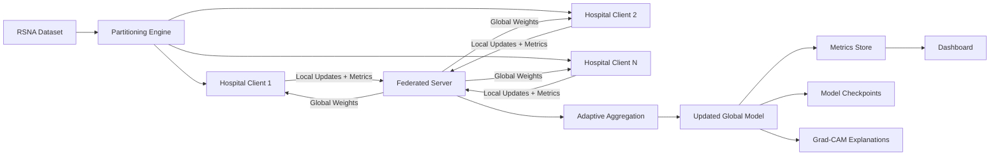
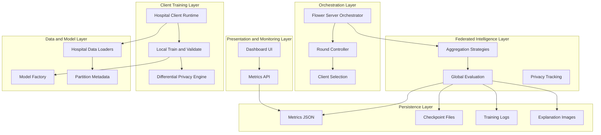
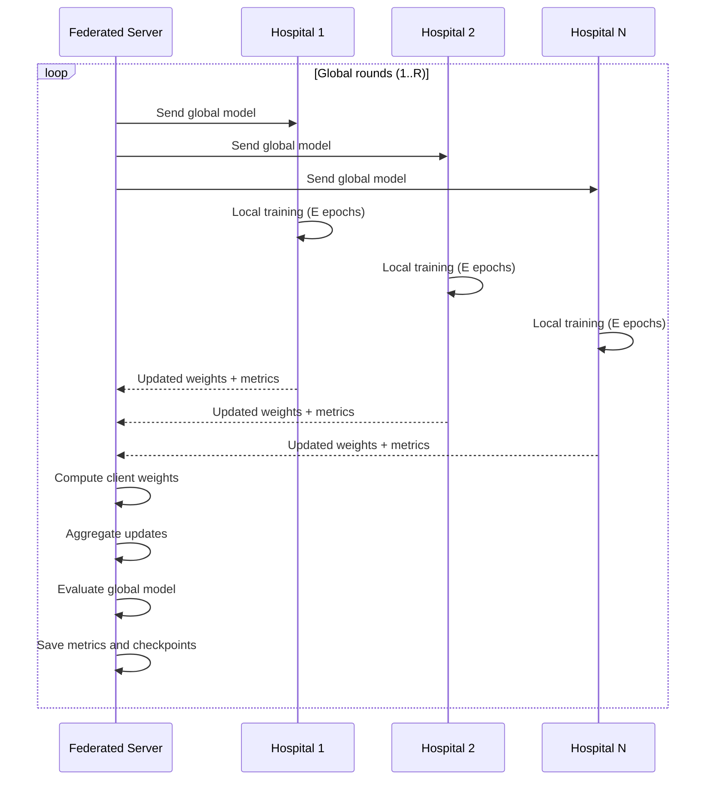
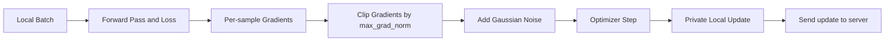
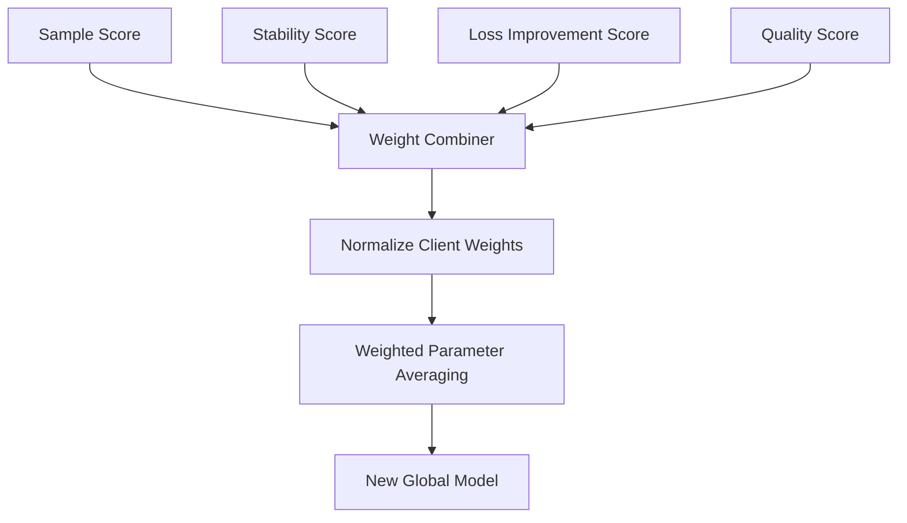
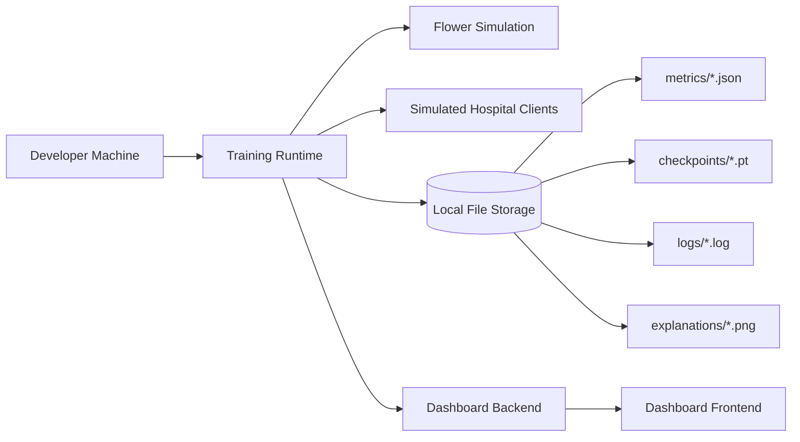

# Hospital Federated Learning
## Design and Architecture Document

## 1. Introduction

### 1.1 Purpose
This document describes the design and architecture of the **Hospital Federated Learning for Pneumonia Detection** system.  
The platform enables multiple hospitals to collaboratively train a chest X-ray classifier while keeping patient data local to each hospital.

### 1.2 Goals
- Build a global pneumonia detection model without centralizing raw medical data.
- Preserve privacy using federated learning and differential privacy.
- Improve training robustness with adaptive aggregation.
- Provide transparent outputs via metrics and explainability artifacts.

### 1.3 Scope
- Federated training simulation with multiple hospital clients.
- Local model training and evaluation at each client.
- Centralized orchestration and aggregation.
- Differential privacy support.
- Metrics tracking, checkpointing, and optional dashboard integration.
- Grad-CAM explainability output generation.

---

## 2. System Overview

### 2.1 Problem Context
Healthcare data is sensitive and distributed across institutions. Moving all data to one central server is often not possible due to privacy and compliance constraints. This system addresses that by moving the model to the data, not the data to the model.

### 2.2 High-Level Architecture

---

## 3. Architectural Layers

---

## 4. Core Components

### 4.1 Data Layer
- Downloads and prepares the RSNA Pneumonia dataset.
- Splits data into hospital-wise partitions (supports non-IID distribution).
- Provides train, validation, and test loaders per hospital.

### 4.2 Model Layer
- Uses EfficientNet-B0 as the default classifier.
- Supports binary output: Normal vs Pneumonia.
- Model weights are exchanged between server and clients per training round.

### 4.3 Federated Client Layer
- Each hospital receives global weights.
- Trains locally on private hospital partition.
- Sends only model updates and metrics to the server.

### 4.4 Federated Server Layer
- Coordinates rounds and client participation.
- Aggregates client updates (FedAvg / FedProx / Adaptive).
- Produces and distributes updated global model.

### 4.5 Privacy Layer
- Differential privacy is applied at local training level.
- Uses clipping and noise addition to protect individual sample contributions.
- Tracks epsilon usage over training.

### 4.6 Monitoring and Explainability Layer
- Collects round-wise metrics (loss, accuracy, AUC, sensitivity, specificity).
- Stores checkpoints and experiment logs.
- Generates Grad-CAM explanation images.

---

## 5. Federated Training Workflow

---

## 6. Differential Privacy Design

### 6.1 Privacy Objective
Ensure that a single patient record has limited impact on model updates.

### 6.2 DP Mechanism
- Per-sample gradient clipping.
- Gaussian noise injection.
- Privacy accounting with \((\epsilon, \delta)\)-DP.

### 6.3 Privacy Controls
- **epsilon**: privacy budget.
- **delta**: failure probability.
- **max_grad_norm**: clipping threshold.

---

## 7. Adaptive Aggregation Design

Client update weights are computed from:
- Sample contribution.
- Stability (loss variance trend).
- Loss improvement.
- Quality score (accuracy behavior).

This strategy improves robustness in heterogeneous (non-IID) hospital settings.

---

## 8. Deployment Architecture (Current Project)

---

## 9. Non-Functional Architecture Considerations

### 9.1 Privacy and Security
- No raw medical image transfer to the server.
- Only model parameters and aggregated metrics are exchanged.
- Differential privacy reduces patient-level leakage risk.

### 9.2 Scalability
- Current setup supports simulation on a single machine.
- Architecture can be extended to distributed real hospital nodes.

### 9.3 Reliability
- Supports configurable minimum participating clients.
- Handles strategy-level control for client failures.

### 9.4 Observability
- Round-level metrics, logs, and checkpoints are persisted.
- Optional dashboard supports live monitoring.

---

## 10. Design Summary

This architecture provides:
- Privacy-preserving collaborative learning across hospitals.
- Flexible aggregation strategy with adaptive weighting.
- Differential privacy integration for stronger confidentiality guarantees.
- End-to-end traceability through metrics, logs, checkpoints, and explanations.

It is a strong base for academic demonstration and can be extended toward production-grade distributed federated deployment.

